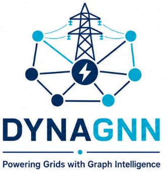
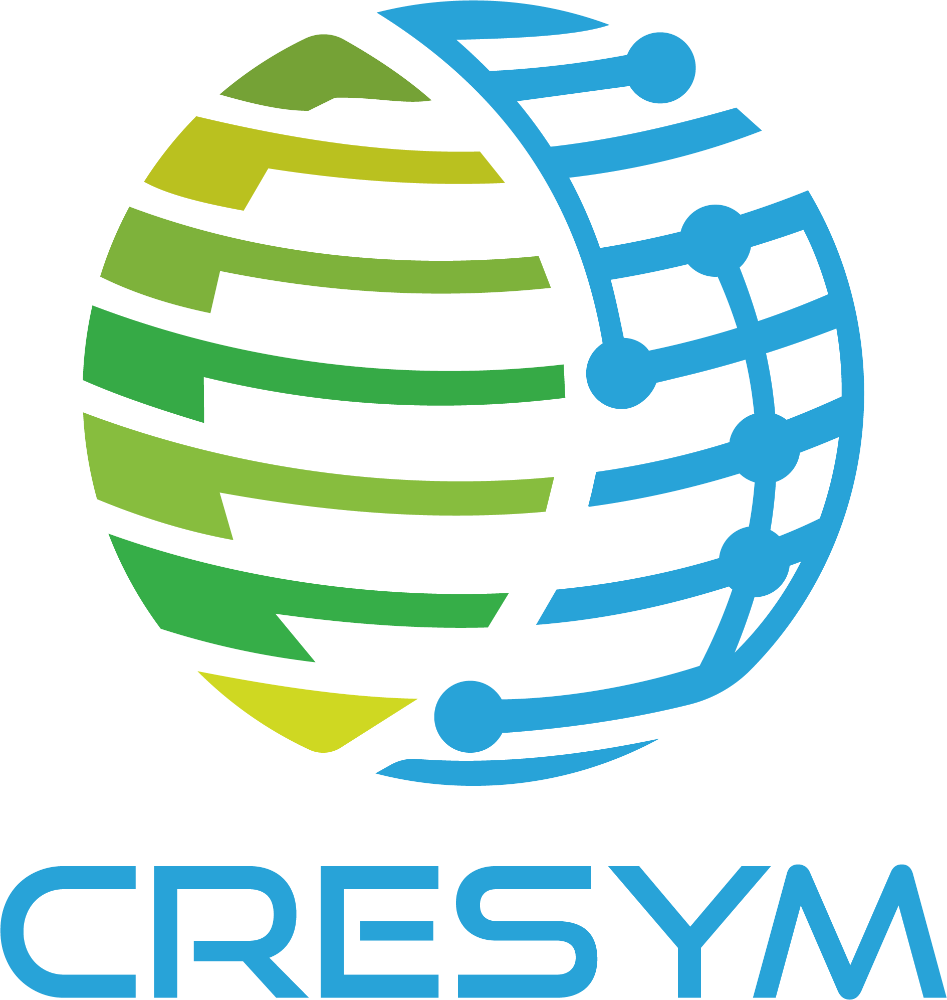

<p align="center">
  
</p>
<p align="center">
  
  
  &nbsp;&nbsp;&nbsp;
  
</p>

**DYNamic Activity Graph Neural Networks** — predict **dynamic activity** (where high-fidelity dynamics matter vs where simplifications may be safe) from steady-state operating points and contingencies.

## Context

This repository centres on **dynamic activity prediction**: a pair-aware residual GINE (v1.2) that estimates, for each component and contingency, how much dynamic behaviour to expect from steady-state inputs.

That prediction stack is self-contained — **`main.py`** runs the full training pipeline; **`DYNAGNN.py`** applies the trained models to new operating points and writes per-component class predictions.

The work also belongs to the wider **AMS (Adaptive Model Selection)** research programme, which asks where a time-domain simulation should retain full model detail. The optional **`AMS/`** folder is the pip package **`dynagnn-ams`**: **node-breaker model reduction** from a scenario `.dsl` plus network IIDM/DYD. Ready-to-use **Nordic checkpoints** are bundled under `AMS/dynagnn_ams/models/Nordic/`.

## What DYNAGNN does

- **Input**: steady-state operating points + contingencies/events
- **Output**: per-component dynamic activity predictions (hotspots)
- **Model (v1.2)**: pair-aware residual GINE — direct multi-class prediction with independent Optuna tuning for Voltage and Spower

## Main entry points

| Script | Role |
|--------|------|
| **`main.py`** | Full **training** pipeline (simulations → KPIs → datasets → Optuna → checkpoints) |
| **`DYNAGNN.py`** | **General inference** — per-component activity classes on new OPs / events (CSV outputs) |
| **`dynagnn-ams` / `AMS/`** | **Model reduction** (optional) — scenario `.dsl` → IIDM switch simplification; **Nordic checkpoints** in `AMS/dynagnn_ams/models/Nordic/` |

See [`AMS/README.md`](AMS/README.md) for the AMS workflow.

## Docs

- **Setup & config**: [`docs/HowTo.md`](docs/HowTo.md)
- **Training / inference / AMS**: [`docs/src/training.md`](docs/src/training.md), [`docs/src/inference.md`](docs/src/inference.md), [`AMS/README.md`](AMS/README.md)

<a id="environment-setup"></a>

## Environment setup

**Python 3.10 is required** (DYNAGNN is developed and tested on 3.10). **Python 3.10.15 is recommended.** Other 3.10.x releases are usually fine; Python 3.11+ is not supported unless you verify all dependencies yourself.

Check your version:

```bash
python3 --version   # expect Python 3.10.x
```

From the project root (`DYNAGNN/`).

### Option A — venv

```bash
cd "/path/to/DYNAGNN"
python3.10 -m venv .venv    # or: python3 -m venv .venv if python3 is 3.10.x
source .venv/bin/activate   # Windows: .venv\Scripts\activate
python3 -m pip install --upgrade pip
```

### Option B — Conda

```bash
cd "/path/to/DYNAGNN"
conda create -n dynagnn python=3.10.15 -y
conda activate dynagnn
python3 -m pip install --upgrade pip
```

### Dependencies (pip)

After creating and activating a environment (Option A or B), install packages in two steps.

DYNAGNN picks the device automatically: `cuda` (NVIDIA or AMD with ROCm) → `mps` (Apple Silicon) → `cpu`. There is no `device` setting in `config.yaml`; install a PyTorch build that exposes your GPU.

> **Note (macOS + Dynawo Docker):** On Mac, Dynawo is commonly run via [Dynawo Docker](https://dynawo.github.io/install/) because there is no native macOS build. If you use that setup, **MPS is not available** for GINE training (PyTorch runs in the Linux container, where Apple’s MPS backend does not exist). Use the **CPU only** PyTorch install from the table below.

**Step 1 — PyTorch** (minimum **2.0**; choose **one** row; confirm `cu*` / `rocm*` on [pytorch.org/get-started](https://pytorch.org/get-started/locally/)):

| Hardware | Command |
|----------|---------|
| **Mac** (Apple Silicon, MPS; native Dynawo / host Python only) | `pip install "torch>=2.0.0"` |
| **Mac** (Dynawo Docker) | `pip install "torch>=2.0.0" --index-url https://download.pytorch.org/whl/cpu` |
| **NVIDIA** (Linux / Windows, CUDA) | `pip install "torch>=2.0.0" --index-url https://download.pytorch.org/whl/cu124` |
| **AMD** (Linux, ROCm) | `pip install "torch>=2.0.0" --index-url https://download.pytorch.org/whl/rocm6.2` |
| **AMD** (Windows, GPU via WSL2) | Install Ubuntu in **WSL2**, then run the **AMD Linux (ROCm)** command above (ROCm PyTorch is not available on native Windows). |
| **CPU only** (any OS; native Windows AMD without WSL2) | `pip install "torch>=2.0.0" --index-url https://download.pytorch.org/whl/cpu` |

Verify the GPU is visible (optional):

```bash
python3 -c "import torch; print('torch', torch.__version__); print('cuda:', torch.cuda.is_available()); print('mps:', getattr(torch.backends, 'mps', None) and torch.backends.mps.is_available())"
```

**Step 2 — DYNAGNN packages** ([`requirements.txt`](requirements.txt)):

```bash
pip install -r requirements.txt
```

If `torch-geometric` fails to install, complete Step 1 first, then see the [PyG installation guide](https://pytorch-geometric.readthedocs.io/en/latest/install/installation.html).

**Dynawo** — install per [dynawo.github.io/install](https://dynawo.github.io/install/), then set `dynawo.path` in `config.yaml` to your environment script (`myEnvDynawo.sh` on Linux, or the Windows install folder / launcher from the Dynawo docs). On **macOS**, use **Dynawo Docker** if you do not have a Linux VM; in that case training falls back to **CPU** (see the macOS + Dynawo Docker note above — **MPS cannot be used**).

---

## Step 0 — Data folder and `config.yaml`

Your data folder must contain an `inputs/` directory structured like:

```
<data.path>/
└── inputs/
    ├── contingencies.csv
    ├── operating_point_1/
    ├── operating_point_2/
    └── …
```

Each `operating_point_<N>/` folder must contain the Dynawo case (`*.iidm` or `*.xiidm`, `*.dyd`, `*.jobs`, `*.par`, and optionally `*.crt`).

See [`docs/HowTo.md`](docs/HowTo.md) for the detailed setup:

- Data folder layout and `inputs/` conventions
- `contingencies.csv` format (types, IDs, Dynawo event mapping)
- Full `config.yaml` key reference

---

<a id="step-1--run-training-mainpy"></a>

## Step 1 — Run training (`main.py`)

```bash
python3 main.py
```

Omit both flags for a **full run**. Use **`--from-step`** to resume from a later stage; use **`--to-step`** to stop after a stage (e.g. `--to-step curve_process` for KPI cut analysis).

```bash
python3 main.py --to-step curve_process   # through combined KPI tables
python3 main.py --to-step split           # through split CSV (includes curve_process)
python3 main.py --from-step build_op_assets # skip init + simulations; from graph assets
python3 main.py --from-step curve_process   # from KPI/curve post-processing
python3 main.py --from-step split --to-step split  # rebuild split only
python3 main.py --from-step split                  # split + dataset + training
python3 main.py --from-step dataset         # from dataset construction
python3 main.py --from-step training        # retrain only
```

Earlier-stage outputs must already exist under `<data.path>/`. See [`docs/HowTo.md`](docs/HowTo.md#pipeline-control---from-step---to-step) for prerequisites per step.

**Note**: if some Dynawo simulations fail, DYNAGNN **does not proceed with those examples**. Downstream steps (graphs, KPIs, dataset build, training) automatically **skip failed scenarios** and continue with the successful ones.

`main.py` writes under `<data.path>/` (graphs, KPIs, datasets, `Simulations_Scenarios/`, log, trained models). On success:

- `<data.path>/model/<study_name>/voltage_best_model.pt`
- `<data.path>/model/<study_name>/spower_best_model.pt`
- `<data.path>/dynagnn.log`

---

## Inference (`DYNAGNN.py`)

```bash
python3 DYNAGNN.py --case-dir /path/to/operating_point --events-csv /path/to/events.csv
```

**`events.csv`** — one row per scenario:

| Column | Description |
|--------|-------------|
| `scenario_id` | Integer label (output subfolder name) |
| `Event` | Fault component id on the graph (same namespace as training contingencies) |

| scenario_id | Event |
|-------------|-------|
| `1` | `<fault_component_id_1>` |
| `2` | `<fault_component_id_2>` |

**Outputs** (under `<case-dir>/dynagnn_output/`):

- `electrical_distance.csv`
- `scenario_<id>/prediction_voltage.csv`, `prediction_spower.csv`

---
## Adaptive Model Selection (`dynagnn-ams`)
**AMS (`dynagnn-ams`)** — optional **model reduction** from a scenario `.dsl` plus network IIDM/DYD: `pip install "dynagnn-ams @ git+https://github.com/SPS-L/DYNAGNN.git#subdirectory=AMS"`, then `dynagnn-ams scenario.dsl network.xiidm network.dyd -n Nordic`. Checkpoints under `AMS/dynagnn_ams/models/<network>/`. Independent of DYNAGNN `main.py`; does not read `config.yaml`. See [`AMS/README.md`](AMS/README.md).

## Nordic example — train on bundled data

The repository includes a ready-made **Nordic** case under `examples/Nordic/`: 9 operating points, `contingencies.csv` (lines, buses, generators, loads, transformers), and Dynawo inputs. Use it to run the full training pipeline end to end.

### What is in `examples/Nordic/`

```
examples/Nordic/
└── data/
    └── inputs/
        ├── contingencies.csv
        ├── operating_point_1/   … Nordic.xiidm, Nordic.dyd, Nordic.jobs, …
        ├── operating_point_2/
        …
        └── operating_point_9/
```

- **Lines / transformers / loads** — **Fault name** is the IIDM equipment id (e.g. `L1011-1013a`, `Tr1-1041`, `01_1`).
- **Buses** — Nordic is **node-breaker**; **Fault name** is a `busbarSection` id (e.g. `1011_131`), not a `bus` id.
- **Generators** — **Fault name** is the **dynamic model id** from `Nordic.dyd` (e.g. `g01`, `g02`), not the IIDM static id.

### Step 1 — Environment

Follow [Environment setup](#environment-setup) (venv or Conda, `pip install -r requirements.txt`, Dynawo installed).

### Step 2 — Configure `config.yaml`

Run the helper script first. It writes the Nordic example defaults into the project-root [`config.yaml`](config.yaml), and fills:

- **`dynawo.path`** from your CLI argument
- **`data.path`** as `<DYNAGNN>/examples/Nordic/data` (derived from the repo root)
- **`optuna.study_name`** (e.g. `nordic_v1`) for `data/training/<study_name>/` and `data/model/<study_name>/`

```bash
cd "/absolute/path/to/DYNAGNN"
python3 Nordic_test_setup.py --dynawo-env "/absolute/path/to/myEnvDynawo.sh" --force
```

See [`docs/HowTo.md`](docs/HowTo.md) for:

- The Nordic operating-point table
- The full Nordic `config.yaml` block (exactly what `Nordic_test_setup.py` writes)

### Step 3 — Run from the project root

```bash
cd "/absolute/path/to/DYNAGNN"
source .venv/bin/activate   # if using venv
python3 main.py
```

`main.py` runs, in order: initialization and Dynawo contingency simulations → graph assets → curve/KPI post-processing (combined KPI tables) → train/val/test split → dataset build → pair-aware GINE Optuna training. Use `--from-step` / `--to-step` to control the run range when rerunning (see [Step 1](#step-1--run-training-mainpy)).

This example has **many** contingencies × 9 operating points; the first full run can take a long time. Progress and errors are written to:

- `<data.path>/dynagnn.log`
- `<data.path>/Simulations_Scenarios/simulation_results.csv` (resume: successful scenarios are skipped on re-run)

### Step 4 — Check trained models

On success you should have:

- `examples/Nordic/data/model/<study_name>/voltage_best_model.pt`
- `examples/Nordic/data/model/<study_name>/spower_best_model.pt`

Intermediate outputs (graphs, KPI tables, datasets, split CSV) live alongside them under `examples/Nordic/data/` (`op_graphs/`, `KPI/`, `Dataset/`, `Simulations_Scenarios/`, etc.).

### Step 5 (optional) — Inference on one operating point

After training, point inference at one OP folder and an events file (same id namespace as `contingencies.csv`):

```bash
python3 DYNAGNN.py \
  --case-dir "/absolute/path/to/DYNAGNN/examples/Nordic/data/inputs/operating_point_1" \
  --events-csv "/path/to/events.csv"
```

Predictions are written under `<case-dir>/dynagnn_output/`.

